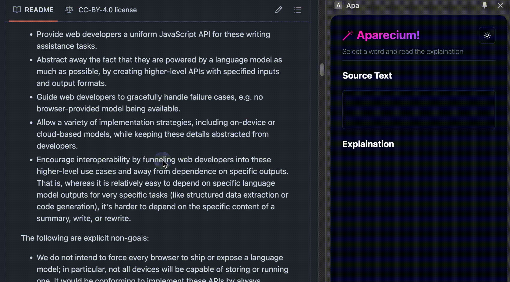
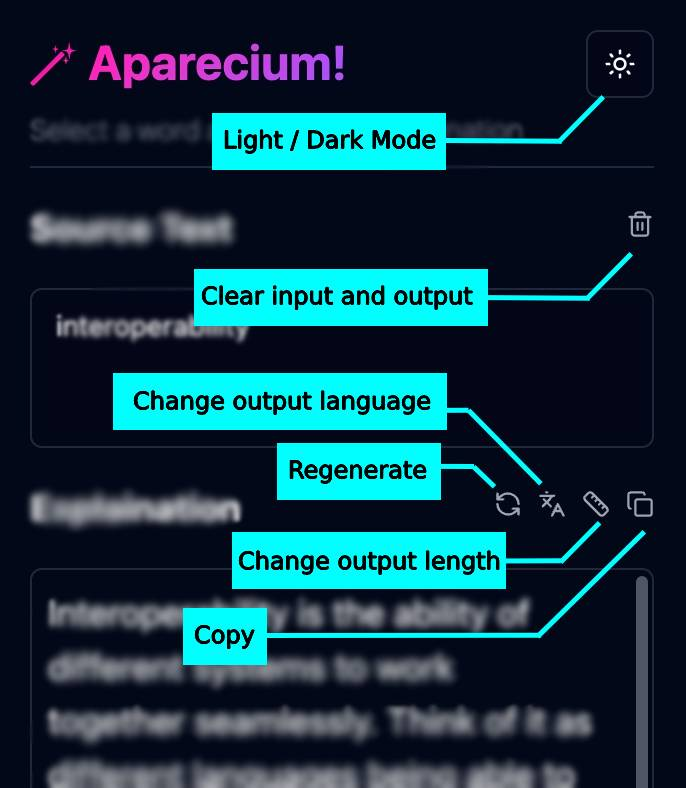

# Apa

Have you ever encountered a word or phrase that you don't understand while reading a paper on arXiv or other websites? Usually you have to copy the text and search it on Google to find the meaning. It's annoying, isn't it?

Now you have Apa, a browser extension that can explain words, phrases, or sentences.

[]()

Apa uses Chrome's built-in AI APIs, including `Prompt API`, `Language Detector API` and `Translator API`.

> The name is a short for "Aparicium", which is a charm in Harry Potter. Aparicium can reveal hidden information on the parchment.

## Features

[]()

- Automatically explains text upon selection
- Understands meaning based on surrounding context
- Adjustable explanation length: short, medium, long
- Supports manual input and paste
- Regenerate explanation if not satisfied
- Copy explanation to clipboard
- Translation between Chinese and English
- Can interrupt/cancel operations
- Light and dark themes

## Installation

1. Clone the repository:

   ```bash
   git clone https://github.com/yourusername/aparecium.git
   ```

2. Load the extension in your **Chrome Canary (latest version)**:
   - Open your browser's extensions page.
   - Enable "Developer mode".
   - Click "Load unpacked" and select the `extension` directory from the project.

## Usage

1. Download the [latest version of Chrome Canary](https://www.google.com/intl/en_ca/chrome/canary/).
2. Enable experimental built-in AI APIs according to [the guides](https://docs.google.com/document/d/18otm-D9xhn_XyObbQrc1v7SI-7lBX3ynZkjEpiS1V04/edit?tab=t.0).
3. Open the extension side panel.
4. Highlight any text on a webpage, the selected text will be catch by Aparecium automatically.
5. Now you can see the explanation of the selected text in the side panel.

## Roadmap

- ✅ Basic explanation.
- ✅ Support manually input text into a textarea.
- ✅ Clear button for input text.
- ✅ Copy button for output text.
- ✅ Abortion.
- ✅ Output as markdown.
- ✅ Translate output text into multiple languages.
- ✅ Remember settings.
- [ ] Clone session when token limit is reached.
- [ ] Better support for uncapability cases and model download progress.
- [ ] Structured output (JSON data that contains explaination, similar words, pronunciation).
- [ ] Read clipboard.
- [ ] Detail level.
- [ ] History list.
- [ ] Share input and output text as an image.
- [ ] Rate the explanation. (Necessary?)
- [ ] Pronunciation and TTS.

## Development
### Prerequisites

> Node.js and npm installed on your machine.


1. Navigate to the project directory:

   ```bash
   cd aparecium
   ```
2. Install dependencies:

   ```bash
   npm install
   ```
3. Hot reload:

   ```bash
   npm run dev
   npm run dev-ext
   ```


### Configuration

- **Vite**: The project uses Vite for fast builds and hot module replacement.
- **Tailwind CSS**: Tailwind is used for styling components.
- **TypeScript**: The codebase is written in TypeScript for type safety.

### Project Structure

- `src/`: Contains the source code for the extension.
  - `components/`: Vue components used in the extension.
  - `lib/`: Utility functions.
  - `assets/`: Styles and images.
- `extension/`: Contains files specific to the browser extension.
- `public/`: Static assets.

## Contributing

Contributions are welcome! Please fork the repository and submit a pull request for any improvements or bug fixes.

## License

This project is licensed under the MIT License. See the [LICENSE](./LICENSE) file for details.

## Contact

For questions or feedback, please contact [qianjunyinggo@gmail.com](mailto:qianjunyinggo@gmail.com).
